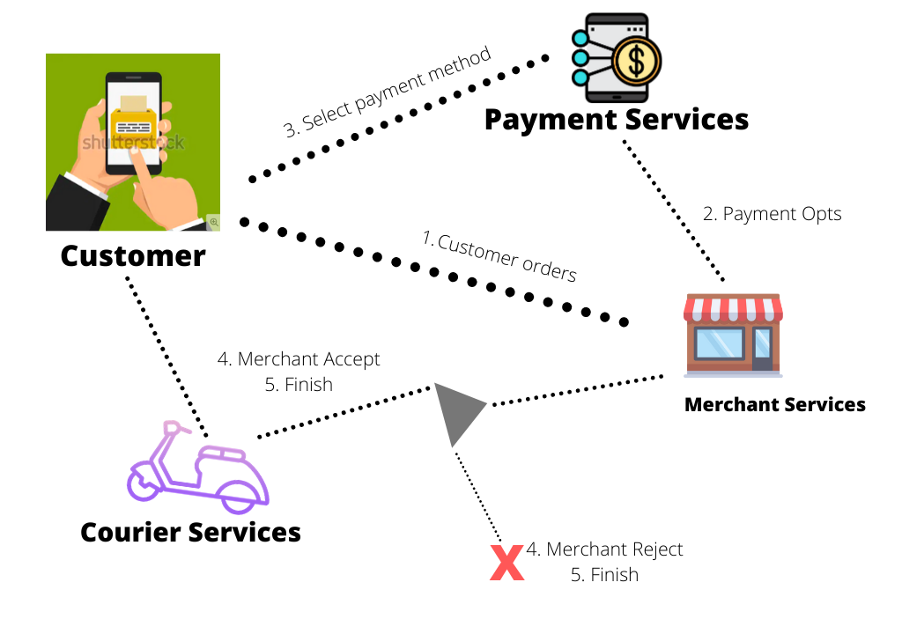
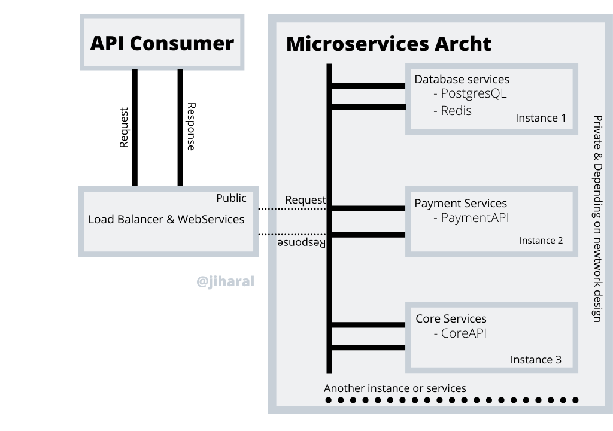

# Aplikasi antar makanan.

# 1. Alur / Flow Umum.

> Secara umum aplikasi ini digunakan oleh oleh dua jenis pengguna ialah Penjual dan Pembeli, Berikut adalah gambaran umum flow dalam aplikasi.

- Customer melakukan orderan.
- Oleh sistem secara automatis di arahkan ke pemilihan metode pembayaran.
- Customer melakuan pembayaran.
- Oleh sistem orderan tersebut di alihkan ke aplikasi merchant. (dalam artian memberikan notifikasi kepada aplikasi merchant)
- Merchant berhak menolak. Dalam artian transaksi tersebut di batalkan dan seluruh uang pelanggan di kembalikan(automasi by sistem berdasarkan pilihan metode pembayaran)
- Merchant menerima √. Semua transaksi berhasil, oleh system di alihkan ke layanan kurir. (Kurir disini bisa di buat sendiri, atau meminta kerjasama dengan goj*k/gr*b dalam bentuk Kerjasama B2B, API, etc.

## Teknology stack.

> Teknologi stack dirancang untuk menetukan standar sebagai acuan untuk pengambangan aplikasi dengan harapan agar proses pengembangan aplikasi selesai dengan baik. Pemilihan teknologi sangatlah berpengaruh untuk pengembangan dan pemeliharaan sistem jangka panjang.

### Infrastruktur.

- GCP (Google Cloud Platform).
- Microsoft Azure.

  Semua pilihan dan permintaan bersadarkan kesepakatan bersama. Pada dasarnya semua layanan infrastruktur yang saya sebutkan di atas sudah tersedia berbagai macam layanan standar, seperti jaringan, komputer virtual, firewall, dll.

### Stack level Back end.

- Go (Google Language) Bahasa pemrograman utama yang di pakai untuk menulis API level bisnis.
- PostgresQL (Database) database untuk penyimpanan utama.
- Redis (Cache) untuk penyimpanan sementara, membantu mengurangi kinerja database server.
- Cron (Shedulle) Untuk penjadwalan, bisa dipakai untuk mengecek transaksi atau pembayaran yang pending, atau lainya yang berhungan dengan aplikasi.
- Docker (Container) Teknologi untuk membangun aplikasi dalam bentuk container untuk kebutuhan scaling. didukung penuh oleh kukbernetes atau docker swarm.
- RabbitMQ / NSQ (Antrian) Untuk menangani orderan/transaksi dalam jumlah banyak untuk menghindari kegagalan transaksi yang di buat oleh system komputer yang berakibat fatal dan berimbas ke bisnis.
- gRPC, RESTFull, GraphQL.(Protokol komunikasi) bisa menggunakan salah satu atau semuanya. tergantung kebutuhan sistem.
- NGINX (Web Services).

### Stack level Front end & dan management aplikasi (Portal untuk merchant dan admin utama)

- Java/Kotlin Android (Untuk pengembangan aplikasi platform android) / Disarankan untuk pengembangan yang kompleks dan native.
- Swift (Untuk pengembangan aplikasi platform iOS) / Disarankan untuk pengembangan yang kompleks dan native.
- Dart/Flutter (Untuk pengembangan Android & iOS) / Disarankan untuk pengembangan cepat & native.
- NodeJS/ExpressJS Bahasa pemrograman yang diguakan untuk mengakses API Utama pada level Aplikasi WEB.
- jade/pug untuk template
- Ajax,Boostrap, Javascript untuk kebutuhan untuk mengelola tampilan dll.

  > Bahasa pemrograman di atas semuanya baik, tergantung metode dan algoritma beserta pemanfaatan plugins dengan baik dan benar.

## Arsitektur Sistem.

### Api Consumer (Front End Apps)

> Api konsumer adalah pengguna API seperti Web App, Mobile App, dan sejenisnya yang berhubungan dengan Sistem Delivery Order yang di bangun.

### Load Balancer & Web Service (Public)

> Merupakan layanan untuk menerima permintaan dari `API Consumer` dan di forward/teruskan ke Layanan-layanan kecil yang sudah di bangun berdasarkan arsitektur sistem. `Docker, NGINX, dan Kubernetes` adalah teknologi yang dapat digunakan pada level ini.

### Microservices Arch (Private)

> Microservices itu sendiri merupakan kumpulan-kumpulan layanan terstruktur yang di pisah berdasarkan fungsi masing-masing layanan. [Selengkapnya bisa di lihat disini](https://microservices.io/).

### Instance

- Layanan Database.

  - `Redis` untuk penyimpanan sementara.
  - `PostgresQL` untuk penyimpanan utama.

- Layanan pembayaran.
  - `Go` Untuk bahasa pemerograman utama.
  - `RabitMQ` untuk di referensikan ke Layanan utama(CoreAPI).
  - `Cron` di referensikan ke Layanan utama(CoreAPI).
  - `Redis & PosgresQL` di referensikan ke Layanan Database.
- Layanan API Utama.
  - `Go` Untuk bahasa pemerograman utama.
  - `RabitMQ` untuk antrian.
  - `Cron` di untuk penjadwalan.
  - `Redis & PosgresQL` di referensikan ke Layanan Database.

# 2. Desain keamanan sistem

> Dalam hal ini saya akan membahas bagaimana proses permintaan dan pengiriman data dari `Core API` ke `API Consumer`.

- Pada level jaringan

  - Berdasarkan arsitektur sistem diatas. Setiap layanan yang ada pada Kotak `Microservices Arcth` menggunakan jaringan yang bersifat private. artinya tidak boleh sembarang IP Address yang masuk dalam lingkup jaringan tersebut kecuali yang di IP Address yang diijinkan.
  - Hanya satu instance yang boleh mengakses jaringan tersebut yaitu `Load Balancer & WebService`. Instance Tersebut bersifat public artinya dapat di akses oleh `API Consumer` pada umumnya.
  - Untuk pengontrolan dan pengalihan layanana, Setiap `API Consumer` harus mengakses melalui `Load Balancer & WebService`.

- Pada level system.
  - Setiap kali `API consumer` ketika mengakses layanan API harus menyertakan `Token` untuk authorized. Untuk token sendiri dapat di generate oleh sistem ketika Aplikasi pada sisi `Pelanggan, Merchant, dan Portal` berhasil login. Dan token tesebut di simpan di `cache` dan akan berubah setiap kali pengguna `login`.
  - Malakukan validasi data yang di kirim melalui API.
  - Mengikuti paduan dan standar keamanan [OWASP](https://www.owasp.org/index.php/OWASP_API_Security_Project).

# 3. RESTFul API berdasarkan dokumentasi apiary

> Untuk pembuatan API ini saya akan mengikuti dokumentasi dari [Apiary](https://testbinar.docs.apiary.io/).

- [Disini](https://github.com/jiharal/apiary)

# 4. API dan Dokumentasi dari [apiary](https://testbinar.docs.apiary.io/)

- Kekurangan-kekurangan pada sisi data.

  - Field `password_digest`, Sebaiknya response ini tidak ditampilkan, karena secara tidak langsung kita memberitahu ke pengguna bagaimana kita menyimpan password. Seseorang sangat bisa manfaatkan hal ini untuk mencari celah keamanan dari sistem kita.
  - Kekurangan field `created_by`, dan `updated_by`, data ini sangat di perlukan untuk melacak siapa yang membuat dan siapa yang terakhir mengupdate data tersebut.

- Kekurangan-kekurangan pada sisi dokumentasi.
  - `Parameter` tidak di deskripsikan secara lengkap mengenai informasi `type data` dari `variabel`.
